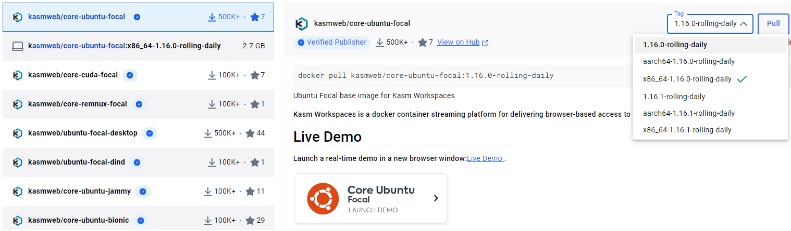
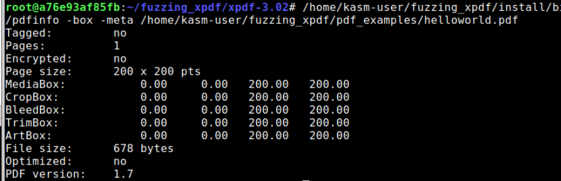
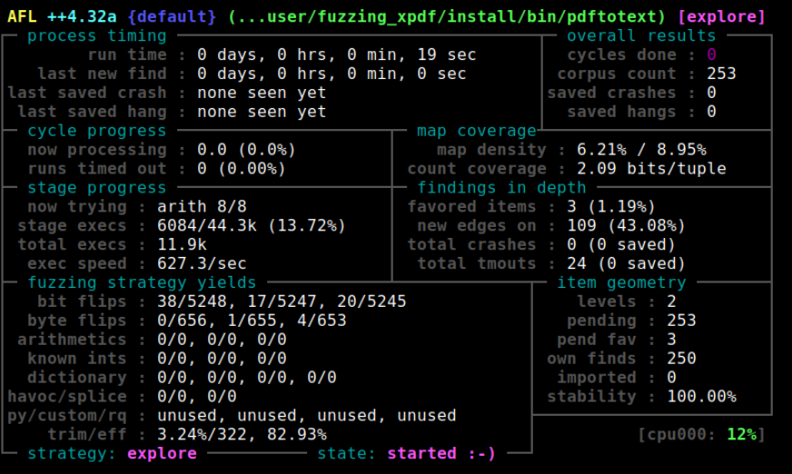
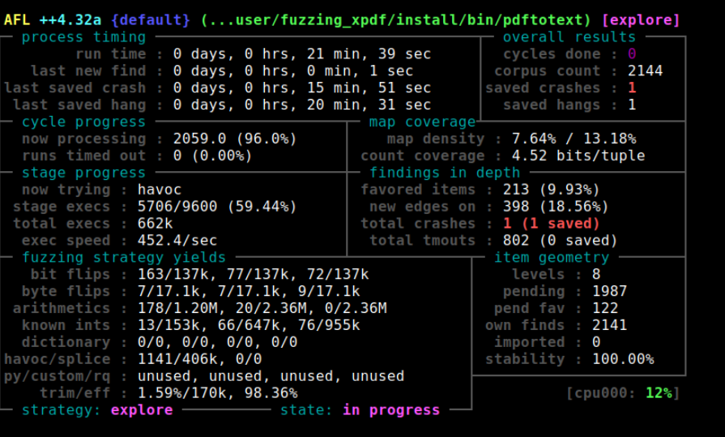
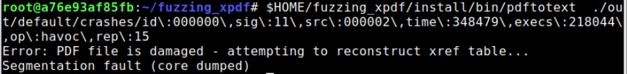
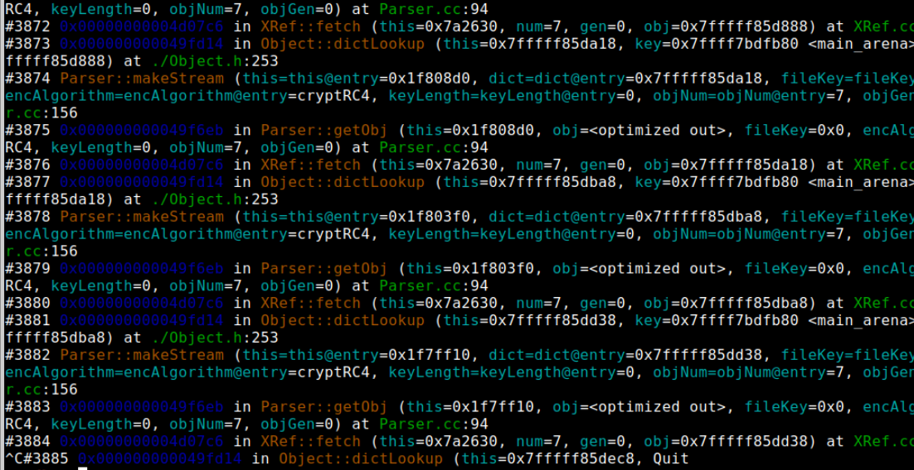
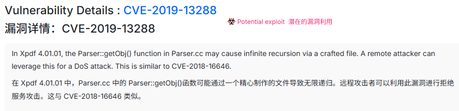
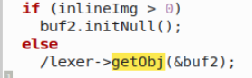
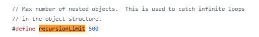
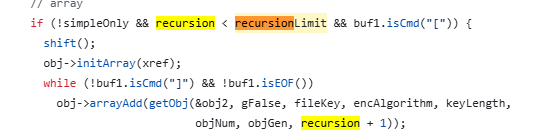

### 涉及的漏洞应用和CVE
**Xpdf** 
**CVE-2019-13288**
### 总结
1. docker 网页gui环境搭建
2. AFL++基础使用，编译插桩和运行fuzz
3. 使用gdb进行crash追踪和分析

### 读前告知

环境及一些路径问题笔者并不一定完全描述清楚，请读者自行检索解决
记住，好记性不如烂笔头！多多实践！

### 环境准备

#### 基础系统

笔者较懒且喜欢gui，还有一个问题就是**虚拟机开的太久有时会自己卡死**，而fuzz的过程总是漫长的，于是使用`windows+docker+kasmweb`的方式使用，即网页版Ubuntu
windows需要先安装WSL和docker desktop，再找到core-ubuntu-focal的镜像进行下载

原就为Linux的读者完全可以接着往下看



```shell
docker run -d --name fuzz_course --shm-size=512m -p 6901:6901 -e VNC_PW=123456 -u root --privileged kasmweb/core-ubuntu-focal:x86_64-1.16.0-rolling-daily
```

#### 麻烦事情
由于为docker老镜像，大部分底层依赖等都没有更新，所以这里需要
换源apt-update、gcc、llvm、python、pip等底层依赖升级
（此处可以结合AFL安装的前置条件一同完成）

#### 构建xpdf
```shell
cd $HOME
mkdir fuzzing_xpdf && cd fuzzing_xpdf/
wget https://dl.xpdfreader.com/old/xpdf-3.02.tar.gz
tar -xvzf xpdf-3.02.tar.gz
cd xpdf-3.02
sudo apt update && sudo apt install -y build-essential gcc
./configure --prefix="$HOME/fuzzing_xpdf/install/"
make
make install
```
#### 测试xpdf
```shell
cd $HOME/fuzzing_xpdf
mkdir pdf_examples && cd pdf_examples
wget https://github.com/mozilla/pdf.js-sample-files/raw/master/helloworld.pdf
wget http://www.africau.edu/images/default/sample.pdf
wget https://www.melbpc.org.au/wp-content/uploads/2017/10/small-example-pdf-file.pdf
$HOME/fuzzing_xpdf/install/bin/pdfinfo -box -meta $HOME/fuzzing_xpdf/pdf_examples/helloworld.pdf
```

#### 打开pdf及测试
```shell
$HOME/fuzzing_xpdf/install/bin/pdfinfo -box -meta $HOME/fuzzing_xpdf/pdf_examples/helloworld.pdf
```


#### AFL安装
https://github.com/AFLplusplus/AFLplusplus/blob/stable/docs/INSTALL.md
```shell
sudo apt-get update
sudo apt-get install -y build-essential python3-dev automake cmake git flex bison libglib2.0-dev libpixman-1-dev python3-setuptools cargo libgtk-3-dev
# try to install llvm 14 and install the distro default if that fails
sudo apt-get install -y lld-14 llvm-14 llvm-14-dev clang-14 || sudo apt-get install -y lld llvm llvm-dev clang
sudo apt-get install -y gcc-$(gcc --version|head -n1|sed 's/\..*//'|sed 's/.* //')-plugin-dev libstdc++-$(gcc --version|head -n1|sed 's/\..*//'|sed 's/.* //')-dev
sudo apt-get install -y ninja-build # for QEMU mode
sudo apt-get install -y cpio libcapstone-dev # for Nyx mode
sudo apt-get install -y wget curl # for Frida mode
sudo apt-get install -y python3-pip # for Unicorn mode
git clone https://github.com/AFLplusplus/AFLplusplus
cd AFLplusplus
make distrib
sudo make install
```
Tips:lld、llvm底层依赖Ubuntu20.04 不一定能直接装到14版本，可以选择装13的，gcc同理

### AFL编译xpdf
删除之前的编译文件
```shell
rm -r $HOME/fuzzing_xpdf/install
cd 原安装包位置
make clean
```
使用**afl-clang-fast 编译**
```shell
export LLVM_CONFIG="llvm-config-13"
CC=$HOME/AFLplusplus/afl-clang-fast CXX=$HOME/AFLplusplus/afl-clang-fast++ ./configure --prefix="$HOME/fuzzing_xpdf/install/"
make
make install
```

### 运行fuzz
```shell
afl-fuzz -i $HOME/fuzzing_xpdf/pdf_examples/ -o $HOME/fuzzing_xpdf/out/ -s 123 -- $HOME/fuzzing_xpdf/install/bin/pdftotext @@ $HOME/fuzzing_xpdf/output
```

- _-i_ indicates the directory where we have to put the input cases (a.k.a file examples)  
    -i 表示我们需要放置输入案例（即文件示例）的目录
- _-o_ indicates the directory where AFL++ will store the mutated files  
    -o 表示 AFL++ 将存储突变文件的目录
- _-s_ indicates the static random seed to use  
    -s 表示要使用的静态随机种子
- _@@_ is the placeholder target's command line that AFL will substitute with each input file name  
    @@是 AFL 将替换为每个输入文件名的目标命令行占位符

因此，基本上 fuzzer 将会运行这个命令`$HOME/fuzzing_xpdf/install/bin/pdftotext <input-file-name> $HOME/fuzzing_xpdf/output` 对每个不同的输入文件

**Tips**：使用docker时需要额外使用`echo core > /proc/sys/kernel/core_pattern`，是因为如果系统配置为将核心转储文件（core）通知发送到外部程序，将导致将崩溃信息发送到Fuzzer之间的延迟增大，进而可能将崩溃被误报为超时，所以得临时修改`core_pattern`文件，这也是为何构建容器时使用`--privileged`方便改写系统文件



静待一段时间，等到出现crash




### 练习题
#### 重现crash
先找到我们crash的文件所在地
`$HOME/fuzzing_xpdf/install/bin/pdftotext  ./out/default/crashes/id\:000000\,sig\:11\,src\:000002\,time\:348479\,execs\:218044\,op\:havoc\,rep\:15`
执行我们引起crash的输入



#### 调试crash以找到问题所在的地方
进入gdb（推荐可以使用pwngdb，但要注意寻找兼容Ubuntu20.04版本的）
输入我们的crash，注意不要使用`<`管道定向，保持源二进制文件的执行
```
pwndbg> run  ./out/default/crashes/id\:000000\,sig\:11\,src\:000002\,time\:348479\,execs\:218044\,op\:havoc\,rep\:15
```
尝试输入`bt`发现栈追踪无限增长，~~**不能定位，于是另寻它路**~~

**好吧，实际上这就是漏洞（无限递归）所在**



https://www.cvedetails.com/cve/CVE-2019-13288/
 

#### 修复问题

通过bt直接定位到Parser.cc文件
结合源码可以得知，是makestream后的shift函数又调用了getOBJ，而getobj又可以makestream，造成了三角循环，无限递归，导致报错



最简单粗暴的方法就是修改掉三角循环中的一角，重新make就不会触发漏洞，但是需要考虑当原本程序执行逻辑恰当！！！


实际xpdf在4.02以后增加了递归次数的限制
在会导致该三角循环的地方，增加了循环次数判断
https://github.com/ashutoshvarma/libxpdf/blob/master/xpdf-4.02/xpdf/Parser.cc





